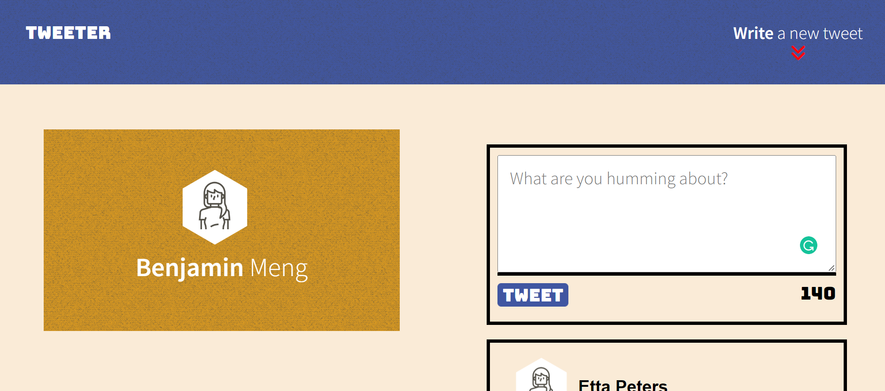
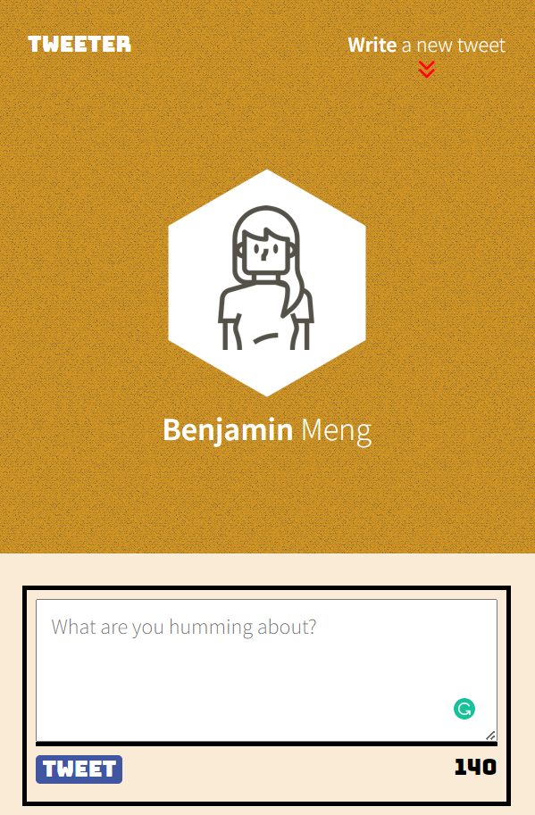
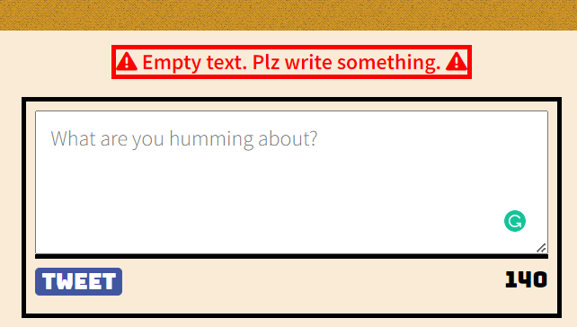
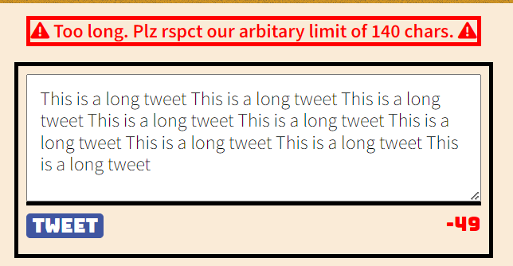

# Tweeter Project

                                    Benjamin Meng

Tweeter is a simple, single-page Twitter clone.

This repository is used to practice HTML, CSS, JS, jQuery and AJAX front-end skills, and their Node, Express back-end skills.

## Final Product:

### Big Screen:

### Small Screen:

### Empty tweet error:

### Exceeds maximun tweets

## Features:

1. User friendly (Responsive interface):different webpage layout and size adjustment for PC (over 1024px) and tablet.
2. Counter for each letters written and the color will turn red if the tweets exceeds maximum tweet limit.
3. Corresponding error messages if the submitted tweets are either empy or over 140 character limit.
4. Shows the tweets on the same page (no need to refresh the page)

## Getting Started

1. Install dependencies using the `npm install` command.
2. Start the web server using the `npm run local` command. The app will be served at <http://localhost:8080/>.
3. Go to <http://localhost:8080/> in your browser.

## Dependencies

- Express
- Node 5.10.x or above
- nodemon 1.9.2
- chance 1.0.2
- md5 2.1.0
